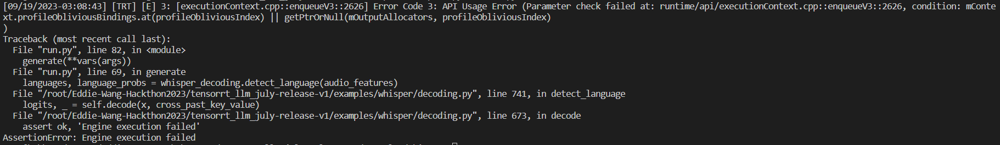
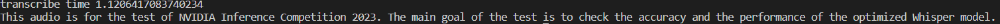
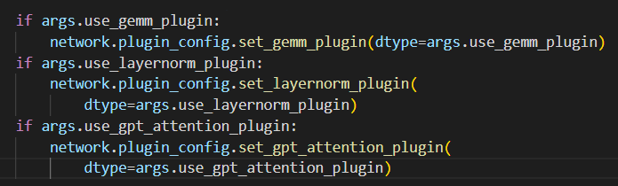
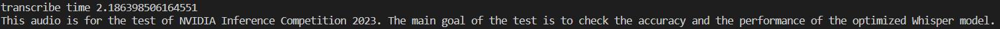
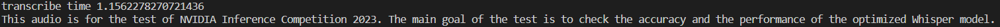

Whisper Model For Tensorrt-LLM
==============
## 模型实现思路
使用的模型为whisper的large模型，支持多语言，保证功能完全。将whisper分解为encoder和decoder两部分，在tensorrt-llm的model文件夹中分别用WhisperEncoder和WhisperDecoder。同时在完整的编码和解码流程在run.py中分别封装为WhisperEncoding和WhisperDecoding两部分，具体实现包含在encoding.py和decoding.py中，最大程度的保证代码的整洁和可读性。

## 对Tensorrt-LLM的改动
原始的Tensorrt-LLM不支持Conv1D和CrossAttention两个算子，对语音识别模型并不友好。在原本Tensorrt-LLM的基础上，我基于原版的Conv2D算子实现了Conv1D算子，基于原版的Attention算子（只支持MultiHeadAttention）实现了CrossAttention算子（仍在Attention内部实现，使Attention抽象正确），最大程度保留了原版代码的同时增加了新的功能，保证之前的模型仍能正常使用，完成了Tensorrt-LLM的正确迭代。

## 可能的BUG
* 插件使用顺序导致tensorrt-llm运行失败  
  使用插件时，按照examples/gpt/build.py的方式将插件设置代码放于代码行with net_guard(network)之前，结果报错。将插件设置代码放于代码行with net_guard(network)之后，结果正确。  

  代码行置于with net_guard(network)之前结果（与gpt方式相同）报错：
    

  代码行置于with net_guard(network)之后结果（与gpt方式不同）不报错： 
    

  如何复现bug：  
  将build.py 266行开始的插件设置代码解除注释，297行开始的插件设置代码注释，再bash build_plugin.sh则bug出现。
    


## 性能对比
* 纯英文音频，全长18.15秒  
pytorch FP16版本encoder+decoder 总计时长约2.18秒

trt-llm FP16版本encoder+decoder 总计时长约1.15秒 （未使用任何插件）

提速约47%，质量未见滑落
* 中英文混杂视频，全长11.90秒
pytorch FP16版本encoder+decoder 总计时长约2.66秒

trt-llm FP16版本encoder+decoder 总计时长约1.53秒 （未使用任何插件）

提速约42%，质量未见滑落

## 测试方法
进入examples/whisper目录  
To prepare model:  
将whisper的large-v2.pt放置于该文件夹下  
To build:  
```
python3 build.py
```

To run:
```
python3 run.py --input_file test.m4a
```
提供两个作者录制的示例音频，分别为test.m4a和test_chinese.m4a

To int8:
```
python3 torch_whisper_convert.py -i large-v2.py -o quantize
python3 build.py --use_gpt_attention_plugin --use_gemm_plugin --use_layernorm_plugin --int8_kv_cache
python3 run.py
```

To summarize:
```
python3 summarize.py
```
