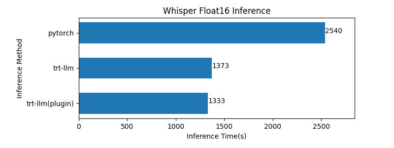
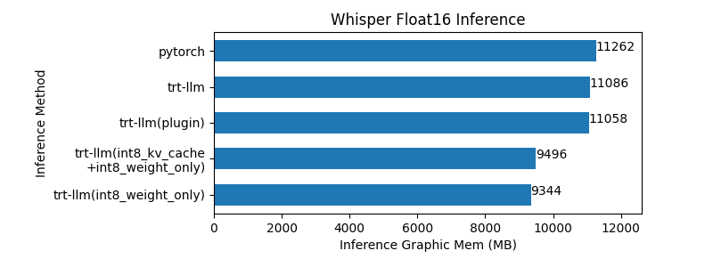

## Whisper Model For Tensorrt-LLM

[](https://tianchi.aliyun.com/competition/entrance/532108)
[](https://github.com/NVIDIA/trt-samples-for-hackathon-cn/tree/master/Hackathon2023)

### 总述

#### 题目介绍
该项目为 NVIDIA TensorRT Hackathon 2023 参赛题目，比赛选题为用TensorRT-LLM实现新模型以及在模型上启用现有feature（2+4）。

#### 模型介绍

本次使用TensorRT-LLM优化的模型为openai提出的whisper模型的large-v2版本。该版本支持多语言语音识别，功能完全，准确度高，速度较快。模型链接如下：

<div align=center>

|名称|参考连接|
|-|-|
||<https://github.com/openai/whisper>|
||<https://openai.com/research/whisper>|
||<https://arxiv.org/abs/2212.04356>|
||<https://arxiv.org/abs/2212.04356>|

</div>

#### 优化效果

在模型优化的过程中我使用了`tensorrt`、`plugin`、`cross_kv_cache_warping`、`int8_kv_cache`以及`weight_only`量化等手段，同时补充了TensorRT-LLM中未提供支持的一些算子，如`cross_attention`以及`conv1d`，最终成功完成了推理优化，使TensorRT-LLM对whisper的在推理速度，推理精度以及显存占用方面均有较大提升。

#### 运行步骤
首先将whisper large-v2.pt模型拷贝至examples/whisper目录下  

- 运行float16无插件版本：
```
bash run.sh
```
- 运行float16带插件版本：
```
bash run_plugin.sh
```
- 运行int8_kv_cache版本：
```
bash run_int8_kv_cache.sh
```
- 运行weight_only版本：
```
bash run_weight_only.sh
```
- 运行int8_kv_cache + weight_only版本：
```
bash run_weight_only_int8_kv_cache.sh
```
- 进行summarize效果比对  
将LibriSpeech test-clean数据集拷贝至examples/whisper/LibriSpeech目录下：
```
python3 summarize.py --engine_dir <engine目录> --test_torch --test_trt_llm
```

### 主要开发工作

本次开发工作主要内容是使用TensorRT-LLM实现了Whisper模型，并应用了对其进行了针对性的优化以及new_feature的应用。

#### 模型结构

     

如图所示，whisper模型主要包括Encoder和Decoder两部分，包含Conv1d、GELU、self-attention、cross-attention以及MLP五种主要结构，其中又可以拆分为众多小算子。

##### 亮点一 ： 基于原始模型实现新算子  
  原始的TensorRT-LLM不支持Conv1D和CrossAttention两个算子，对语音识别模型并不友好。在原本TensorRT-LLM的基础上，我基于原版的Conv2D算子实现了Conv1D算子，基于原版的Attention算子（只支持MultiHeadAttention）实现了CrossAttention算子（仍在Attention内部实现，使Attention抽象正确），最大程度保留了原版代码的同时增加了新的功能，保证之前的模型仍能正常使用，完成了TensorRT-LLM的正确迭代。

  conv1d新增接口：  
   

  cross_attention新增接口：  
   
  

##### 亮点二 ： cross_kv_cache_warping  
  原始的模型每一次推理都需要重新计算Cross-Attention的KV-Cache，但由于Cross-Attention每一次的输入都相同，所以这是不必要的。因此，我将Cross-Attention中KV-Cache的计算从DecoderLayer中拆分出来，并且Warping进一个模型中，该模型在第一次Decoder推理之前就将Cross-Attention中KV-Cache的值计算出来，并作为输入传给Decoder，减少计算量。

  cross_kv_waring新增类：  
   

##### 亮点三 ： 新feature的运用
  将int8_kv_cache应用到whisper的推理上，完成了new feature在模型上的成功部署。与gpt中对int8_kv_cache应用不同的是，在whisper的权重转换中，不能只依赖原本的转换方法，需要对whisper权重中的q/k/v的weight做concat得到qkv结构的权重来配合转换。

##### 亮点四 ： 各种优化方法的组合
  本次模型优化不仅仅是将模型搭建了起来，还使用了TensorRT-LLM中提供的各种便利的优化条件为模型推理提速。这里包括一些便利的plugin以及TensorRT-LLM中便捷的weight-only量化方法。这两种方法均为模型优化起到了良好的作用。

##### 亮点五 ： 工程化的模型推理
  在这次whisper的模型推理实现过程中，并没有采用非常适用于Decoder-Only模型的GenerationSession方法，用调用接口的方式去推理模型，而是将内部的session提取出来使用，用更加灵活的方法进行模型推理，为如何使用TensorRT-LLM提供了一种新思路。在run.py文件中，我并没有沿用gpt中的方法，而是使用两个类：WhisperEncoding类和WhisperDecoding类分别封装了Whisper进行Encoding和Decoding的过程，并将内部的方法放在encoding.py和decoding.py两个文件夹中。这样的工程化处理方式使得代码的逻辑非常清晰，且易于维护。

  逻辑清晰的推理代码：  
   

### 开发与优化过程
开发与优化的过程总体可分为模型搭建与模型优化两部分，下面依次介绍：

#### 模型搭建过程
##### Step 1
首先在tensorr-llm/models中创建模型文件，并在__init__中注册（添加任何layer或module都需要在对应的__init__.py中注册），接着就可以在模型文件中搭建模型了。搭建的模型需要继承自Module类，并且实现__init__，forward和prepare_inputs三个方法。需要注意的是，一定需要有一个变量调用mark_output方法输出，不然网络无法建立。

  模型搭建示例：  
   

##### Step 2
写好模型文件后，下一步需要在examples中创建模型文件夹，并在里面创建build.py文件。build.py文件需要调用模型文件中写好的模型。首先使用builder.create_builder_config()配置模型的基本信息，接着调用模型并传入已经训练好的权重，这里的权重需要新建立weight.py文件并配置好每一个算子的传入权重。传入权重后，TensorRT-LLM通过一次推理得到网络的推理路线和推理权重，再用该网络build_engine即可得到优化后的engine，再序列化得到最后的模型。

  模型build示例：  
   

##### Step 3
得到序列化的模型后，需要简历run.py进行模型的推理。有两种方式可以进行该推理，如果模型和传统的LLM结构相似，可以使用tensorrt_llm.runtime.GenerationSession进行推理，需要注意的是传入的参数需要仔细考虑，防止结果出错。如果模型无法完全复用以上方法，也可以自己使用session = Session.from_serialized_engine进行模型推理，这样的优点是可以完全自定义推理的方式，便于工程化的实现。

##### Step 4
在推理成功实现后，需要对推理的性能和精度进行测算，与原本的模型效果进行比对，因此需要简历summarize.py文件。summarize.py需要实现原生模型（pytorch或huggingface）的推理（可以参考我的方法，将原生模型推理和TensorRT-LLM模型推理复用在一个类中，作为工程化的最简实现，并且需要实现类似DataLoader的方法传入数据，以及实现一个精度测算方法测量精度，测量时间则使用tensorrt_llm.profiler进行准确的计量。

#### 模型优化过程
##### 软硬件环境：
NVIDIA-SMI 525.105.17  
Driver Version: 525.105.17  
CUDA Version: 12.1  
TensorRT Version: 9.0.0.2 EA  
TensorRT-LLM Version: tensorrt_llm_july-release-v1   
GPU Version: NVIDIA A10

##### plugin:
TensorRT-LLM提供了丰富的插件供使用者调用来提供模型的性能，其中gemm_plugin/layer_norm_plugin可以直接调用,gpt_attention_plugin需要增加对应的输入，并仔细调整保证输入正确后即可使用，weight_only_quant_matmul_plugin则是实现weight_only量化后必须要调用的。

##### weight_only:
weight_only量化主要需要注意的在weight.py文件中，其本身使用的是无需calibrator的ptq量化，仅需对weight做调整。在weight.py中对ColumnLinear/RowLinear算子加入针对的调整得到量化后的权重再赋给模型即可。而在build.py中需要确保在with net_guard(network):之前set_weight_only_quant_matmul_plugin，不然会报错。

##### int8_kv_cache:
实现int8_kv_cache前提是需要使用gpt-attention插件，即attention必须含有qkv这一linear算子。对没有将其合并的模型，可手动进行合并，合并后通过capture_activation_range方法得到算子的qmin和qmax，之后进行qat即可。需要注意的是，这里需要calibrator，因此需要验证集进行校准。

  int8_kv_cache合并过程：  
   

### 优化效果
我从模型推理的速度、精度以及所占显存三点来分析模型的优化效果，TensorRT-LLM与pytorch均使用float16精度推理，测试数据使用LibriSpeech/test-clean标准数据集：

#### 推理速度
  
TensorRT-LLM相比于pytorch推理在float16下速度有大幅度提升，pytorch推理完测试集用时约2540s，TensorRT-LLM在加入插件后用时约1333秒，性能提升在47%以上。

#### 推理精度
  
TensorRT-LLM相比于pytorch在推理精度上也有提升。其中经过int8_weight_only优化后的模型在test-clean数据集上的wer相比于pytorch降低约1.5%，大幅提高了精度，其他优化后的模型精度也与pytorch模型相近。

#### 显存占用
  
pytorch模型推理时显存占用约为11GB，未进行量化的TensorRT-LLM模型在推理时相比于原始模型显存占用下降约200MB，经过量化后的模型显存占用有大幅度的下降，约下降2GB，极大的降低了推理所需的显存需求。

### Bug报告
#### 插件使用顺序导致tensorrt-llm运行失败  
<https://github.com/NVIDIA/trt-samples-for-hackathon-cn/issues/95>


### 送分题答案
- 请在报告中写出 /root/workspace/tensorrt_llm_july-release-v1/examples/gpt/README 里面 “Single node, single GPU” 部分如下命令的输出（10分）模型为gpt2-medium
```
python3 run.py --max_output_len=8
```
输出为：  
  
- 请在报告中写出 /root/workspace/tensorrt_llm_july-release-v1/examples/gpt/README 里面 “Summarization using the GPT model” 部分如下命令的rouge 分数（10分）模型为gpt2-medium
```
python3 summarize.py --engine_dir trt_engine/gpt2/fp16/1-gpu --test_hf --batch_size 1 --test_trt_llm --hf_model_location=gpt2 --check_accuracy --tensorrt_llm_rouge1_threshold=14
```
输出为：  
  
